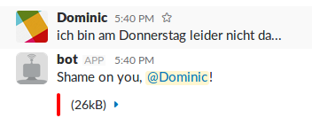

# Running bot
1. Grab the repo and run:
```sh
$ npm install @slack/client --save
```
2. Add a bot integration in Slack [here](https://slack.com/services/new/bot)
3. Add your bot's API key to config.js
4. Run from the command line:
```sh
$ node bot.js
```
5. Invite your brand new bot into the channels you'd like it to watch.

## Example
